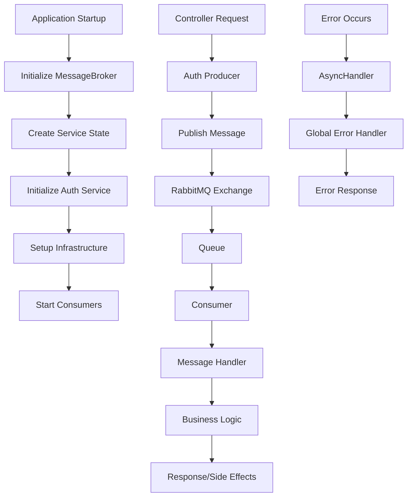

# 🧪 Messaging System Testing Guide

## 📋 Table of Contents
1. [Testing Order](#testing-order)
2. [Function Flow Diagram](#function-flow-diagram)
3. [Step-by-Step Testing](#step-by-step-testing)
4. [Integration Testing](#integration-testing)
5. [Error Testing](#error-testing)
6. [Performance Testing](#performance-testing)

---

## 🔄 Testing Order

### **Phase 1: Core Infrastructure Testing**
Test the foundation components first before building up to complex operations.

### **Phase 2: Service Layer Testing**
Test individual messaging services in isolation.

### **Phase 3: Producer/Consumer Testing**
Test message publishing and consumption separately.

### **Phase 4: Integration Testing**
Test complete end-to-end message flows.

### **Phase 5: Error & Edge Case Testing**
Test failure scenarios and recovery mechanisms.

---

## 📊 Function Flow Diagram



---

## 🧪 Step-by-Step Testing

### **1. Core Infrastructure Testing**

#### **Test 1.1: Message Broker State Creation**
```javascript
// File: tests/unit/messageBroker.test.js
import { createBrokerState } from '../src/helpers/messaging/core/messageBroker.js';

describe('MessageBroker State Creation', () => {
  test('should create default broker state', () => {
    const state = createBrokerState();
    
    expect(state.config.defaultExchange).toBe('default');
    expect(state.config.retryAttempts).toBe(3);
    expect(state.channels).toBeInstanceOf(Map);
    expect(state.exchanges).toBeInstanceOf(Set);
    expect(state.queues).toBeInstanceOf(Set);
  });
  
  test('should create broker state with custom config', () => {
    const config = {
      defaultExchange: 'test.exchange',
      retryAttempts: 5
    };
    const state = createBrokerState(config);
    
    expect(state.config.defaultExchange).toBe('test.exchange');
    expect(state.config.retryAttempts).toBe(5);
  });
});
```

#### **Test 1.2: Channel Management**
```javascript
// Test channel creation and caching
import { getChannel } from '../src/helpers/messaging/core/messageBroker.js';

describe('Channel Management', () => {
  test('should create and cache channels', async () => {
    const state = createBrokerState();
    
    // First call - creates channel
    const { channel: channel1, state: newState1 } = await getChannel(state, 'test-channel');
    expect(channel1).toBeDefined();
    expect(newState1.channels.has('test-channel')).toBe(true);
    
    // Second call - returns cached channel
    const { channel: channel2, state: newState2 } = await getChannel(newState1, 'test-channel');
    expect(channel2).toBe(channel1);
  });
});
```

#### **Test 1.3: Exchange and Queue Setup**
```javascript
import { ensureExchange, ensureQueue, bindQueue } from '../src/helpers/messaging/core/messageBroker.js';

describe('Infrastructure Setup', () => {
  test('should ensure exchange exists', async () => {
    const state = createBrokerState();
    const newState = await ensureExchange(state, 'test.exchange', 'topic');
    
    expect(newState.exchanges.has('test.exchange:topic')).toBe(true);
  });
  
  test('should ensure queue exists', async () => {
    const state = createBrokerState();
    const newState = await ensureQueue(state, 'test.queue');
    
    expect(newState.queues.has('test.queue')).toBe(true);
  });
});
```

### **2. Service Layer Testing**

#### **Test 2.1: Service State Creation**
```javascript
// File: tests/unit/baseService.test.js
import { createServiceState, addSchema, addHandler } from '../src/helpers/messaging/core/baseService.js';
import Joi from 'joi';

describe('Service State Management', () => {
  test('should create service state', () => {
    const state = createServiceState('test-service');
    
    expect(state.serviceName).toBe('test-service');
    expect(state.config.exchangeName).toBe('test-service.exchange');
    expect(state.initialized).toBe(false);
  });
  
  test('should add schema to service', () => {
    const state = createServiceState('test-service');
    const schema = Joi.object({ id: Joi.string().required() });
    
    const newState = addSchema(state, 'test.message', schema);
    
    expect(newState.schemas.has('test.message')).toBe(true);
    expect(newState.schemas.get('test.message')).toBe(schema);
  });
  
  test('should add handler to service', () => {
    const state = createServiceState('test-service');
    const handler = async (data) => console.log(data);
    
    const newState = addHandler(state, 'test.message', handler, { maxRetries: 3 });
    
    expect(newState.handlers.has('test.message')).toBe(true);
    expect(newState.handlers.get('test.message').handler).toBe(handler);
  });
});
```

#### **Test 2.2: Auth Service Initialization**
```javascript
// File: tests/unit/authMessagingService.test.js
import { createAuthServiceState, initializeAuthService } from '../src/helpers/messaging/services/authMessagingService.js';

describe('Auth Service', () => {
  test('should create auth service state with schemas and handlers', () => {
    const state = createAuthServiceState();
    
    expect(state.serviceName).toBe('auth');
    expect(state.schemas.has('user.registered')).toBe(true);
    expect(state.handlers.has('user.registered')).toBe(true);
    expect(state.schemas.size).toBeGreaterThan(0);
    expect(state.handlers.size).toBeGreaterThan(0);
  });
  
  test('should initialize auth service', async () => {
    const state = createAuthServiceState();
    const initializedState = await initializeAuthService(state);
    
    expect(initializedState.initialized).toBe(true);
    expect(initializedState.brokerState).toBeDefined();
  });
});
```

### **3. Producer Testing**

#### **Test 3.1: Producer State Management**
```javascript
// File: tests/unit/authProducer.test.js
import { createProducerState, publishUserRegistered } from '../src/helpers/messaging/services/authProducer.js';

describe('Auth Producer', () => {
  test('should create producer state', () => {
    const state = createProducerState();
    
    expect(state.initialized).toBe(false);
    expect(state.serviceState).toBe(null);
  });
  
  test('should publish user registered event', async () => {
    const producerState = createProducerState();
    const user = {
      _id: '507f1f77bcf86cd799439011',
      emailAddress: 'test@example.com',
      name: 'Test User'
    };
    const confirmationData = {
      token: 'test-token',
      code: 'test-code'
    };
    
    const { result, state } = await publishUserRegistered(producerState, user, confirmationData);
    
    expect(result).toBeDefined();
    expect(result.messageId).toBeDefined();
    expect(state.initialized).toBe(true);
  });
});
```

#### **Test 3.2: Message Publishing Flow**
```javascript
describe('Message Publishing Flow', () => {
  test('should publish and validate message structure', async () => {
    const producerState = createProducerState();
    const user = createTestUser();
    const confirmationData = createTestConfirmationData();
    
    // Mock message capture
    const publishedMessages = [];
    jest.spyOn(MessageBroker, 'publishMessage').mockImplementation(async (state, exchange, routingKey, message) => {
      publishedMessages.push({ exchange, routingKey, message });
      return { success: true, messageId: 'test-message-id' };
    });
    
    await publishUserRegistered(producerState, user, confirmationData);
    
    expect(publishedMessages).toHaveLength(1);
    expect(publishedMessages[0].exchange).toBe('auth.exchange');
    expect(publishedMessages[0].routingKey).toBe('auth.user.registered');
    expect(publishedMessages[0].message.userId).toBe(user._id.toString());
  });
});
```

### **4. Consumer Testing**

#### **Test 4.1: Consumer State Management**
```javascript
// File: tests/unit/authConsumer.test.js
import { createConsumerState, startConsumers, stopConsumers } from '../src/helpers/messaging/services/authConsumer.js';

describe('Auth Consumer', () => {
  test('should create consumer state', () => {
    const state = createConsumerState();
    
    expect(state.initialized).toBe(false);
    expect(state.isRunning).toBe(false);
    expect(state.consumers).toEqual([]);
    expect(state.metrics.messagesProcessed).toBe(0);
  });
  
  test('should start consumers', async () => {
    const consumerState = createConsumerState();
    
    const startedState = await startConsumers(consumerState);
    
    expect(startedState.initialized).toBe(true);
    expect(startedState.isRunning).toBe(true);
    expect(startedState.consumers.length).toBeGreaterThan(0);
  });
  
  test('should stop consumers', async () => {
    const consumerState = createConsumerState();
    const startedState = await startConsumers(consumerState);
    
    const stoppedState = await stopConsumers(startedState);
    
    expect(stoppedState.isRunning).toBe(false);
    expect(stoppedState.consumers).toEqual([]);
  });
});
```

#### **Test 4.2: Message Processing**
```javascript
describe('Message Processing', () => {
  test('should process message manually', async () => {
    const consumerState = createConsumerState();
    const messageData = {
      userId: '507f1f77bcf86cd799439011',
      email: 'test@example.com',
      name: 'Test User',
      confirmationToken: 'test-token',
      confirmationCode: 'test-code',
      timestamp: new Date().toISOString()
    };
    
    const { success, state } = await processMessage(
      consumerState,
      'user.registered',
      messageData,
      { messageId: 'test-message-id' }
    );
    
    expect(success).toBe(true);
    expect(state.metrics.messagesProcessed).toBe(1);
  });
});
```

### **5. Integration Testing**

#### **Test 5.1: End-to-End Message Flow**
```javascript
// File: tests/integration/messageFlow.test.js
describe('End-to-End Message Flow', () => {
  test('should complete full message lifecycle', async () => {
    // 1. Setup
    const producerState = createProducerState();
    const consumerState = createConsumerState();
    
    // 2. Start consumers
    const startedConsumerState = await startConsumers(consumerState);
    
    // 3. Publish message
    const user = createTestUser();
    const confirmationData = createTestConfirmationData();
    
    const { result } = await publishUserRegistered(producerState, user, confirmationData);
    
    // 4. Wait for message processing
    await new Promise(resolve => setTimeout(resolve, 1000));
    
    // 5. Verify message was processed
    const metrics = await getMetrics(startedConsumerState);
    expect(metrics.metrics.messagesProcessed).toBeGreaterThan(0);
    
    // 6. Cleanup
    await stopConsumers(startedConsumerState);
  });
});
```

#### **Test 5.2: Controller Integration**
```javascript
// File: tests/integration/controllerIntegration.test.js
import request from 'supertest';
import app from '../src/app.js';

describe('Controller Integration', () => {
  test('should register user and publish event', async () => {
    const userData = {
      name: 'Test User',
      emailAddress: 'test@example.com',
      password: 'TestPassword123!'
    };
    
    // Mock message publishing
    const publishedEvents = [];
    jest.spyOn(AuthProducer, 'publishUserRegistered').mockImplementation(async (state, user, data) => {
      publishedEvents.push({ user, data });
      return { result: { messageId: 'test-message-id' }, state };
    });
    
    const response = await request(app)
      .post('/api/v1/auth/register')
      .send(userData)
      .expect(201);
    
    expect(response.body.message).toBe('User registered successfully');
    expect(publishedEvents).toHaveLength(1);
    expect(publishedEvents[0].user.emailAddress).toBe(userData.emailAddress);
  });
});
```

### **6. Error Testing**

#### **Test 6.1: Error Handling**
```javascript
describe('Error Handling', () => {
  test('should handle message validation errors', async () => {
    const producerState = createProducerState();
    const invalidUser = {
      _id: '507f1f77bcf86cd799439011',
      // Missing required fields
    };
    
    await expect(
      publishUserRegistered(producerState, invalidUser, {})
    ).rejects.toThrow('Message validation failed');
  });
  
  test('should handle connection errors gracefully', async () => {
    // Mock connection failure
    jest.spyOn(MessageBroker, 'getChannel').mockRejectedValue(new Error('Connection failed'));
    
    const producerState = createProducerState();
    const user = createTestUser();
    
    await expect(
      publishUserRegistered(producerState, user, {})
    ).rejects.toThrow('Connection failed');
  });
});
```

#### **Test 6.2: Retry Mechanism**
```javascript
describe('Retry Mechanism', () => {
  test('should retry failed operations', async () => {
    let attempts = 0;
    jest.spyOn(MessageBroker, 'publishMessage').mockImplementation(async () => {
      attempts++;
      if (attempts < 3) {
        throw new Error('Temporary failure');
      }
      return { success: true, messageId: 'test-message-id' };
    });
    
    const producerState = createProducerState();
    const user = createTestUser();
    
    const result = await publishUserRegistered(producerState, user, {});
    
    expect(attempts).toBe(3);
    expect(result.result.messageId).toBe('test-message-id');
  });
});
```

---

## 🔄 Function Call Flow

### **1. Application Startup Flow**
```
1. app.js starts
2. connectRabbitMQ() establishes connection
3. AuthConsumer.startConsumers() initializes consumers
4. Server starts listening for requests
```

### **2. Message Publishing Flow**
```
Controller Request
    ↓
AuthProducer.publishUserRegistered()
    ↓
ensureInitialized() → initializeAuthService()
    ↓
AuthMessagingService.publishUserRegistered()
    ↓
BaseService.publishServiceMessage()
    ↓
validateMessage() → MessageBroker.publishMessage()
    ↓
getChannel() → publishWithRetries()
    ↓
RabbitMQ Exchange → Queue
```

### **3. Message Consumption Flow**
```
RabbitMQ Queue
    ↓
Consumer receives message
    ↓
createConsumerWrapper() → createMessageHandler()
    ↓
parseMessageContent() → handler execution
    ↓
handleUserRegistered() → Resendmail()
    ↓
channel.ack() → updateMetrics()
```

### **4. Error Handling Flow**
```
Error occurs in any function
    ↓
asyncHandler catches error
    ↓
Global error handler processes
    ↓
httpError() formats response
    ↓
Client receives error response
```

---

## 🧪 Testing Commands

### **Run All Tests**
```bash
# Unit tests
npm run test:unit

# Integration tests  
npm run test:integration

# End-to-end tests
npm run test:e2e

# All tests with coverage
npm run test:coverage
```

### **Test Specific Components**
```bash
# Test message broker only
npm test -- --testPathPattern=messageBroker

# Test auth service only
npm test -- --testPathPattern=authMessaging

# Test producers only
npm test -- --testPathPattern=Producer

# Test consumers only
npm test -- --testPathPattern=Consumer
```

### **Manual Testing**
```bash
# Start application
npm run dev

# In another terminal, run test script
node scripts/testMessaging.js
```

---

## 📊 Test Coverage Goals

- **Unit Tests**: 90%+ coverage
- **Integration Tests**: 80%+ coverage
- **End-to-End Tests**: 70%+ coverage

### **Critical Paths to Test**
1. ✅ Message publishing and validation
2. ✅ Message consumption and processing
3. ✅ Error handling and retries
4. ✅ Connection management
5. ✅ State management
6. ✅ Health checks and monitoring

---

## 🚀 Performance Testing

### **Load Testing**
```javascript
// Test high-volume message publishing
describe('Load Testing', () => {
  test('should handle 1000 messages per second', async () => {
    const producerState = createProducerState();
    const promises = [];
    
    for (let i = 0; i < 1000; i++) {
      promises.push(publishUserRegistered(producerState, createTestUser(), {}));
    }
    
    const startTime = Date.now();
    await Promise.all(promises);
    const duration = Date.now() - startTime;
    
    expect(duration).toBeLessThan(1000); // Should complete within 1 second
  });
});
```

### **Memory Testing**
```javascript
// Test for memory leaks
describe('Memory Testing', () => {
  test('should not leak memory during extended operation', async () => {
    const initialMemory = process.memoryUsage().heapUsed;
    
    // Run 10000 operations
    for (let i = 0; i < 10000; i++) {
      await publishUserRegistered(createProducerState(), createTestUser(), {});
    }
    
    // Force garbage collection
    if (global.gc) global.gc();
    
    const finalMemory = process.memoryUsage().heapUsed;
    const memoryIncrease = finalMemory - initialMemory;
    
    // Memory increase should be reasonable
    expect(memoryIncrease).toBeLessThan(50 * 1024 * 1024); // 50MB
  });
});
```

---

This testing guide provides a comprehensive approach to testing your functional messaging system in the correct order, ensuring each component works individually before testing the integrated system. Follow this guide to build confidence in your messaging infrastructure! 🎯